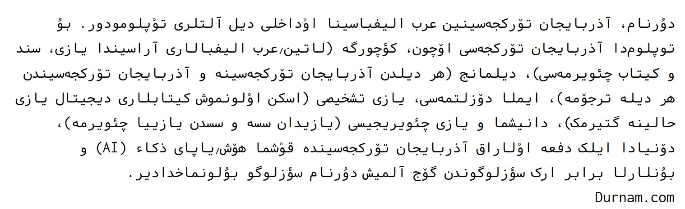
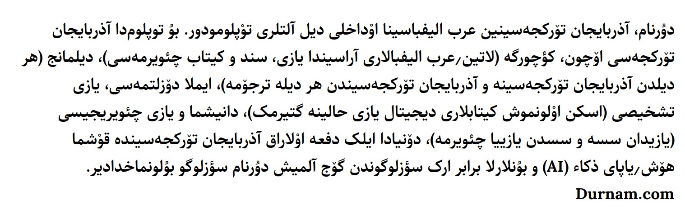

# Xaqan-Font-Family
A Azerbaijani (azb) Font Family, Originally made by **Saber Rastikerdar**

## خاقان فونت عائله‌سی
رحمتلیک صابر راستی‌کردار «وزیر فونت» اثرینین اۆزرینده قورولموش «خاقان» عائله‌سی بو فونت‌لارا آذربایجان تۆرکجه‌سینده اولان حرف‌لری (ۆ ۇ وْ ؤ ؽ ݣ) آرتاراق حاضیرلاییپ‌دیر. 

- خاقان (چالیشمادا)
- خاقان کد (حاضیر)
- خاقان قارانقوش (Regular آغؽرلیغی و Bold آغؽرلیغی حاضیر)

